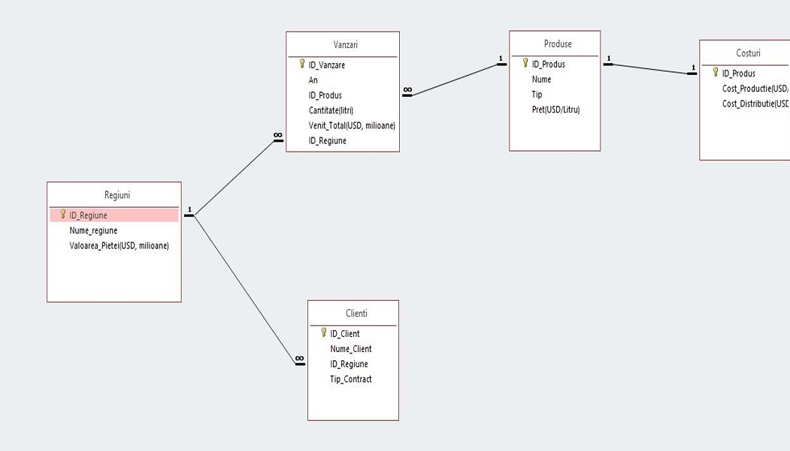
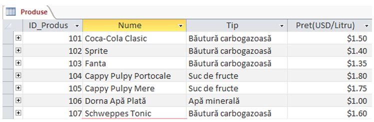

# 📊 Sales Data Analysis & Decision Support System


---

## 📖 Overview

This project presents a **Decision Support System (DSS)** developed for the analysis of Coca-Cola sales data.

The application combines a relational database created in **Microsoft Access** with advanced analysis performed in **Microsoft Excel**, providing business insights through dashboards, descriptive statistics and forecasting models.

The objective is to support managerial decision-making by identifying the most profitable regions, products and future business opportunities.

---

# ✨ Features

✔ Relational database design

✔ Database relationships

✔ Data validation

✔ Descriptive statistics

✔ Outlier detection (IQR)

✔ Pivot Tables

✔ Pivot Charts

✔ Interactive Dashboard

✔ Revenue analysis

✔ Profitability analysis

✔ Business Forecasting

---

# 🛠 Technologies

| Technology | Purpose |
|------------|---------|
| Microsoft Access | Relational Database |
| Microsoft Excel | Data Analysis |
| Pivot Tables | Business Intelligence |
| Pivot Charts | Data Visualization |
| Dashboard | Executive Reporting |
| IQR Method | Outlier Detection |

---

# 🗂 Database Structure

The database contains five connected entities:

- 🌍 Regions
- 🥤 Products
- 👥 Customers
- 💰 Sales
- 📦 Costs

The relationships between these tables allow comprehensive analysis of sales performance across regions and products.

---

# 📈 Data Analysis Workflow

The project follows the complete analytical process:

1. Database Design
2. Data Collection
3. Data Validation
4. Data Quality Assessment
5. Descriptive Analysis
6. Outlier Detection
7. Pivot Table Analysis
8. Dashboard Creation
9. Revenue & Profit Forecasting
10. Business Recommendations

---

# 📊 Dashboard Preview


---

# 🔗 Database Relationships




---

# 📉 Pivot Analysis


---

# 📦 Products Table



---

# 📁 Repository Structure

```
sales-data-analysis-dss
│
├── database
│   └── ProiectSSDAcces.accdb
│
├── excel
│   └── ProiectSSDExcel.xlsx
│
├── documentation
│   └── Project_Report.pdf
│
├── screenshots
│   ├── dashboard.png
│   ├── relationships.png
│   ├── pivot1.png
│   └── produse.png
│
└── README.md
```

---

# 📚 Documentation

The complete project documentation is available in the **documentation** folder.

It includes:

- Database design
- Access implementation
- Excel analysis
- Pivot Tables
- Dashboard
- Forecasting
- Conclusions

---

# 🎯 Key Results

- Identified the best-performing regions.
- Compared product profitability.
- Analysed production and distribution costs.
- Created interactive business dashboards.
- Built optimistic and pessimistic forecasting scenarios.
- Generated recommendations for strategic decision-making.

---

# 👨‍💻 Author

**Andrei Barbu**

Bachelor's graduate passionate about:

- Software Development
- Backend Development
- Data Analysis
- Business Intelligence

---

⭐ If you found this project interesting, feel free to explore the documentation and source files.